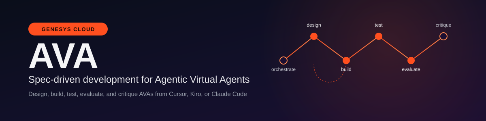

# AVA - Spec-Driven Development




Bring the full Genesys Cloud Agentic Virtual Agent (AVA) lifecycle into your AI coding IDE. Design, build, test, evaluate, and critique AVAs from Cursor, Kiro, or Claude Code without hand-writing a single API call.

## Quick Start

1. **Install [`uv`](https://docs.astral.sh/uv/getting-started/installation/)** if you don't have it already. (Ensure `uv` is not installed in a virtual environment because the wizard needs access to global Python.)
2. **Run the setup wizard**:

    ```bash
    curl -sSL https://raw.githubusercontent.com/purecloudlabs/genesys-ava-skills/main/install.sh | sh
    ```

3. **Follow the prompts** — pick your IDE (Cursor, Kiro, or Claude Code), provide your Genesys Cloud region and OAuth credentials, and confirm the install plan.
4. **Restart your IDE** (or reload MCP), then start a new agent session and say something like:
   > Help me design a new AVA

   The `ava-dispatch` skill takes it from there.

## Usage Examples

Once installed, start a new agent session in your IDE and use natural language. Here are common workflows:

| What you want to do | What to say |
| ------------------- | ----------- |
| Create a new AVA from scratch | "Help me design a new AVA for appointment scheduling" |
| Iterate on an existing AVA | "Update my Travel Booking AVA to add a cancellation flow" |
| Add knowledge to an AVA | "Add FAQ knowledge cards to my Support AVA" |
| Build and publish | "Build and publish my AVA" |
| Write evaluation scenarios | "Create test scenarios for my AVA" |
| Run evaluations | "Evaluate my AVA against the test set" |
| Get a quality review | "Critique my AVA" |
| Start a conversation with a published AVA | "Start a session with my AVA and test it" |

You don't need to remember skill names — `ava-dispatch` reads your local session state and routes to the right skill automatically.

## Prerequisites

To use these skills with a Genesys Cloud org, you need a role with these permissions:

| Domain         | Entity                                           | Actions                           |
| -------------- | ------------------------------------------------ | --------------------------------- |
| `integrations` | `action`                                         | `view` (or `bridge:actions:view`) |
| `agentic`      | `virtualAgent`                                   | `add`, `edit`, `view`             |
| `agentic`      | `virtualAgentVersion`                            | `add`, `edit`, `view`             |
| `agentic`      | `virtualAgentVersionJob`                         | `add`, `view`                     |
| `agentic`      | `virtualAgentSession`, `virtualAgentSessionTurn` | `add`                             |
| `knowledge`    | `knowledgebase`                                  | `view`                            |
| `knowledge`    | `knowledgeSetting`                               | `view`                            |
| `knowledge`    | `source`                                         | `view`                            |

These core grants are always required, and the installation will fail the permissions check if any are missing.

<details>

<summary>See Optional Permissions</summary>

**Mock DataAction authoring** (optional — setup sets `AVA_MOCK_DATA_ACTIONS_DISABLED=true` when any are missing):

| Domain         | Entity        | Actions                            |
| -------------- | ------------- | ---------------------------------- |
| `integrations` | `integration` | `view`, `add`, `edit`              |
| `integrations` | `action`      | `add`, `edit`, `delete`, `execute` |

**Knowledge Fabric FileUpload** (optional — setup sets `AVA_KNOWLEDGE_UPLOAD_DISABLED=true` when any are missing):

| Domain      | Entity             | Actions                         |
| ----------- | ------------------ | ------------------------------- |
| `knowledge` | `source`           | `view`, `add`                   |
| `knowledge` | `synchronization`  | `view`, `add`, `edit`, `upload` |
| `knowledge` | `knowledgeSetting` | `view`, `add`, `edit`           |

Mock DataAction authoring and Knowledge Fabric FileUpload tools are enabled by default. If the OAuth client is missing those extra grants, setup disables the matching tools automatically. Discovery tools (e.g., `list_resources`, `get_data_action_schema`, `validate_knowledge`) stay available either way.

</details>

## Installation

The install script downloads the wheel and runs `ava-mcp setup` automatically. During the configuration, the wizard asks you for the following:

| Decision               | Values                                                                                                                              |
| ---------------------- | ----------------------------------------------------------------------------------------------------------------------------------- |
| Install scope          | `project` (this repo, recommended) or `user` (all projects; not recommended)                                                        |
| IDE(s)                 | Cursor, Kiro, and Claude Code                                                                                                       |
| Actions                | Install MCP and/or Install/refresh skills and subagents                                                                             |
| Habitat                | public API region such as prod-use1 (stored as environment variable `AVA_HABITAT`) — asked only for Install MCP                     |
| Credentials            | OAuth client credentials (preferred) or access token — asked only for Install MCP                                                   |
| Mock / knowledge flags | auto-computed from an in-process probe — not a user question                                                                        |

To install or reconfigure MCP manually, run `ava-mcp setup`. To refresh skills and subagents after an update, run `ava-mcp update`.

## AI Skills

After the installation is complete, the following AI Skills are installed that will be invoked as needed:

| Skill          | What it does                                                                                                                                                                                          |
| -------------- | ----------------------------------------------------------------------------------------------------------------------------------------------------------------------------------------------------- |
| `ava-dispatch` | Entry point. Routes incoming requests to the right skill based on local session state — detects new vs existing AVA, checks for remote changes, and dispatches accordingly. Every session starts here. |
| `ava-design`   | Collects or edits AVA config — name, role, instructions, guardrails, tools, events, context variables, test cases — into a design artifact the build skill consumes.                                  |
| `ava-knowledge` | Authors, validates, and uploads Knowledge Fabric FileUpload content, and ensures a FileUpload Knowledge Source and Knowledge Setting for the AVA.                                                    |
| `ava-build`    | Builds and publishes the AVA from the design artifact, validating the definition before it reaches the Sage API. Handles both new AVAs and version updates.                                           |
| `ava-test`     | Authors turn-based evaluation scenarios (persona, goal, ordered turns, reference trajectory, dimension-tagged rubric) and assembles them into a test set.                                             |
| `ava-evaluate` | Runs the scenarios as multi-turn conversations and reports a success-rate scorecard. Projects cost first, then delegates scenarios to the scenario-runner subagent.                                    |
| `ava-critique` | Reviews an AVA design or published version for quality — best-practice compliance, payload correctness, test coverage, deployment readiness.                                                          |
| `ava-analysis` | Deep AVA-definition analysis (role, tools, knowledge, configuration, guardrails) that produces an in-memory report. Used by the `ava-critique` subagent.                                              |

`ava-analysis` is an auxiliary skill invoked by critique — it is not a lifecycle step of its own.

## Sub-agents

After the installation is complete, the following sub-agents are installed that will be invoked as needed:

| Subagent              | What it does                                                                                                                                                                                                                                                                                                                                                                        |
| --------------------- | ----------------------------------------------------------------------------------------------------------------------------------------------------------------------------------------------------------------------------------------------------------------------------------------------------------------------------------------------------------------------------------- |
| `ava-scenario-runner` | Runs one turn-based evaluation scenario end-to-end in an isolated context — acts as the simulated user, drives the conversation via the `cicero_*` tools, runs Layer 1 (deterministic trajectory) and Layer 2 (rubric) checks, and persists per-attempt results. Scoring happens once, after every runner finishes, via `generate_scorecard`. Runs in parallel for fast evaluation. |
| `ava-critique`        | Drives the `ava-analysis` skill to produce an authoring-quality review, then calls `generate_critique_report` and returns a summary.                                                                                                                                                                                                                                                |
| `ava-design-assist`   | Runs comprehensive cookbook analysis on a design-in-progress to detect advanced patterns and suggest fixes before saving.                                                                                                                                                                                                                                                           |

## AVA Harness

The AVA Harness is a Model Context Protocol (MCP) server that gives your IDE agent direct, validated access to the Genesys Cloud AVA lifecycle.

The Harness exposes each AVA operation as a Pydantic-validated tool. Instead of hand-writing raw API calls and retrying after the backend rejects a malformed payload, the Harness validates each payload locally — bad payloads are caught **before any request reaches Genesys Cloud**. Every tool calls the public Genesys Cloud API; there is no private-backend fallback.

## Tools

### AVA management

| Tool                           | Description                                                                                                 |
| ------------------------------ | ----------------------------------------------------------------------------------------------------------- |
| `list_resources`               | Find resources in the org. Use `resource_type="ava"` first to get `agentId` values. Optional `name` filter. |
| `get_ava`                      | Get full details of a specific AVA by ID.                                                                   |
| `create_ava`                   | Create a new AVA. Idempotent — returns the existing AVA if the name matches.                                |
| `get_latest_saved_version`     | Get the most recent version (any status) as an editable definition.                                         |
| `get_latest_published_version` | Get the latest ProductionReady version.                                                                     |
| `create_version`               | Create a new version from a validated `VersionDefinition`.                                                  |
| `publish_version`              | Publish a version and poll until complete (TestReady or ProductionReady).                                   |

### DataAction discovery

| Tool                     | Description                                                                                   |
| ------------------------ | --------------------------------------------------------------------------------------------- |
| `list_resources`         | Find DataActions with `resource_type="data_action"` (optional name filter) and get their IDs. |
| `get_data_action_schema` | Fetch a DataAction's input/output schema to auto-populate AVA tool config.                    |

### Knowledge discovery

| Tool                         | Description                                                                                                                         |
| ---------------------------- | ----------------------------------------------------------------------------------------------------------------------------------- |
| `list_resources`             | Find Knowledge Bases, Settings, or Sources with `resource_type` `"knowledge_base"`, `"knowledge_setting"`, or `"knowledge_source"`. |
| `validate_knowledge`         | Offline Markdown card validation — gates upload on structural FAIL.                                                                 |
| `ensure_knowledge_source`    | Reuse or create a FileUpload Knowledge Source.                                                                                      |
| `upload_knowledge_documents` | Sync, upload, complete, and wait until FileUpload documents are ready.                                                              |
| `ensure_knowledge_setting`   | Reuse or create a Knowledge Setting bound to one source.                                                                            |

FileUpload authoring tools (`ensure_knowledge_source`, `upload_knowledge_documents`, `ensure_knowledge_setting`) are on by default. Disable with `AVA_KNOWLEDGE_UPLOAD_DISABLED=true` if the OAuth client lacks the Knowledge Fabric grants. `list_resources` and `validate_knowledge` stay available either way.

### Conversation sessions

| Tool                   | Description                                                                       |
| ---------------------- | --------------------------------------------------------------------------------- |
| `cicero_start_session` | Start a session against a published AVA and return the greeting.                  |
| `cicero_send_message`  | Send a user message and return the agent's response, tool calls, and next action. |
| `cicero_end_session`   | Terminate an active session (best-effort cleanup).                                |

### Evaluation

| Tool                       | Description                                                                            |
| -------------------------- | -------------------------------------------------------------------------------------- |
| `validate_trajectory`      | Deterministic Layer 1 comparison of actual tool calls vs a reference trajectory.       |
| `generate_scorecard`       | Score every persisted attempt in an eval run and write JSON / Markdown / HTML reports. |
| `generate_critique_report` | Render an authoring-quality critique into JSON / Markdown / HTML reports.              |

### Mock DataActions *(on by default)*

Disable by setting `AVA_MOCK_DATA_ACTIONS_DISABLED=true` if your OAuth client
lacks the Mock DataAction authoring grants listed under Install.

| Tool                      | Description                                                       |
| ------------------------- | ----------------------------------------------------------------- |
| `create_mock_data_action` | Create a mock DataAction for testing reference trajectories.      |
| `replace_mock_responses`  | Replace the entire mock response table of an existing DataAction. |

`list_resources(resource_type="data_action")` and `get_data_action_schema` stay available regardless.

## The lifecycle

```text
ava-dispatch → ava-design ⇄ ava-knowledge → ava-build → ava-test → ava-evaluate
                        ↑                                          │
                        └──── ava-critique (any time) ─────────────┘
```

**Reading the diagram:**

| Arrow    | Meaning                                                                                                                                                                                                |
| -------- | ------------------------------------------------------------------------------------------------------------------------------------------------------------------------------------------------------ |
| `→`      | Hands off to the next skill in sequence.                                                                                                                                                               |
| `⇄`      | Bidirectional — `ava-design` and `ava-knowledge` iterate together. Knowledge authoring may surface changes that feed back into the design artifact, and design changes may trigger new knowledge work.  |
| `↑ └──`  | `ava-critique` can be invoked at any point in the lifecycle and feeds findings back to `ava-design` for revision.                                                                                      |

**Flow summary:**

1. `ava-dispatch` — routes your request to the right skill based on local session state. Detects new vs existing AVA and checks for remote changes before dispatching.
2. `ava-design` ⇄ `ava-knowledge` — iteratively refine the AVA definition and its knowledge content until both are ready.
3. `ava-build` — validates and publishes the design artifact as a new AVA version.
4. `ava-test` — authors evaluation scenarios against the published version.
5. `ava-evaluate` — runs the scenarios and produces a scorecard.
6. `ava-critique` (any time) — reviews quality and feeds findings back to design. Not a sequential step; invoke it whenever you want a second opinion.

## Where sessions are stored

Each authoring session writes to `.ava-lifecycle/` in your project root (gitignored). Every AVA gets its own subdirectory, so multiple AVAs and sessions never overwrite each other:

```text
.ava-lifecycle/
├── index.json          # every local AVA session: slug → agent_id, gc_version, status
└── <ava-slug>/         # one folder per AVA
    ├── design-artifact.json
    ├── knowledge/      # Fabric Markdown cards + upload artifacts (ava-knowledge)
    ├── test-cases/
    ├── test-sets/
    └── eval-runs/
```

In a nutshell, `ava-dispatch` compares the last known Genesys Cloud AVA version against the live one and prompts you to pull, continue locally, or start fresh if the AVA was edited elsewhere.

## License

This code is provided under the MIT license with no maintenance or support. See [LICENSE](./LICENSE).
